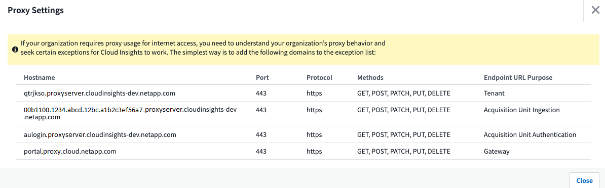

= Release Notes for Cloud Insights

[.lead]
Here are some of the things we've been working on for Cloud Insights.

:toc: macro
:hardbreaks:
:toclevels: 2
:nofooter:
:icons: font
:linkattrs:
:imagesdir: ./media/ 

=== August 2021

==== Enhanced User Role Management 

Cloud Insights now allows even greater freedom for assigning user roles and access controls. Users can now be assigned granular permissions for monitoring, reporting, and Cloud Secure separately.  

link:https://docs.netapp.com/us-en/cloudinsights/concept_user_roles.html[Find out more] about the different levels of access in the Cloud Insights documentation. 

////
==== Improved User Role Management

Cloud Insights now allows greater freedom for assigning link:https://docs.netapp.com/us-en/cloudinsights/concept_user_roles.html[user roles] in each of its three distinct Feature Sets: _Monitoring and Optimization_, _Cloud Secure_, and _Reporting_. A user may be assigned a different role in each Feature Set, with accompanying permission levels specific to that Feature Set:

|===
|Role	|Monitoring	|Cloud Secure	|Reporting

|Account Owner	
3+>|Can modify subscriptions, view billing and usage information, and perform all Administrator functions for Monitoring & Optimization, Cloud Secure, and Reporting.
Owners can also invite and manage users, as well as manage SSO Authentication and Identity Federation settings. 

The Account Owner is created when you register for Cloud Insights.

It is strongly recommended to have at least two Account Owners for each Cloud Insights environment. 

|Administrator	
|Can perform all Monitoring & Optimization functions, all user functions, as well as management of data collectors, API keys, and notifications.
An Administrator can also invite other users but can only assign Monitor and Optimize roles. 

|Can perform all Cloud Secure functions, including those for Alerts, Forensics, data collectors, automated response policies, and APIs for Cloud Secure.
An Administrator can also invite other users but can only assign Cloud Secure roles.

|Can perform all User/Author functions, as well as all administrative tasks such as configuration of reports, and the shutdown and restart of reporting tasks.
An Administrator can also invite other users but can only assign Reporting roles.

|User	
|Can view and modify dashboards, queries, alerts, annotations, annotation rules, and applications, and manage device resolution.
|n/a	
|Can perform all Guest/Consumer functions as well as create and manage reports and dashboards.

|Guest	
|Has read-only access to asset pages, dashboards, alerts, and can view and run queries.
|n/a	
|Can view, schedule, and run reports and set personal preferences such as those for languages and time zones. Guests/Consumers cannot create reports or perform administrative tasks.

|===

It is recommended to verify your user's roles, including SSO roles if appropriate, following this update.
////

////
==== More powerful Variables

Dashboards are better than ever with the ability to define link:https://docs.netapp.com/us-en/cloudinsights/concept_dashboard_features.html#variables[variables based on attributes], which can be universally applied to all widgets on your dashboard, or widgets of your choosing. Powerful filtering options allow you to set wildcards in your variables as well as select multiple individual attributes or counters.

image:Variables_Choose_Filter_Scope.png[Variable Filter and Scope]
////

==== Automatic Widget Naming

Widgets are automatically named based on the first widget query. The name is created from fields such as the metric name (or object name, for tables) and "Group by" attributes (metric as well as aggregation method). Different widget types may use some or all of these when creating an automatic name.

image:WidgetNameExample.png[Widget Naming Example]

Selecting a new object or grouping attribute updates the automatic name. And of course you can always give the widget your own name if desired.

==== Alerts and Monitors available in top search

You can now search for alerts in Cloud Insights' top search box. 

image:Search_Alert.png[Top Search for Alerts]

==== Alerts on asset landing pages

Alerts are now shown in the Expert View section of an asset landing page. 

image:Alerts_In_Expert_View.png[Alerts in Expert View]

The *Related Alerts* table on an asset's landing page enables you to quickly and easily investigate alerts that occur related to the asset.

image:Alerts_on_Landing_Page.png[Related Alerts Table]

==== Excluded devices shown in FC Resolution Status

FC Resolution now shows devices that are specifically excluded from identification with a status of _Excluded_. 

==== Viewing Proxy URLs

You can view your proxy endpoint URLs by clicking the *Proxy Settings* link when choosing a data collector during onboarding, or the link under _Proxy Settings_ on the *Help > Support* page. A table like the following is displayed.

==== Improved auditing

The Audit page includes improvements in viewing and filtering audit events, as well as clearer audit messages.  Read more about Audit features link:https://docs.netapp.com/us-en/cloudinsights/concept_audit.html[here].

==== AHR Onboarding
An Automatic Device Resolution tutorial video is available during user onboarding as well as in the link:https://docs.netapp.com/us-en/cloudinsights/concept_feature_tutorials.html[Feature Tutorials] documentation.

==== Additional Operating Systems supported

The Cloud Insights Acquisition Unit supports the following operating systems, in addition to those already supported:

* Centos (64-bit) 7.9 and 8.3
* Debian (64-bit) 10
* Oracle Enterprise Linux (64-bit) 7.9 and 8.3
* Red Hat Enterprise Linux (64-bit) 7.9 and 8.3
* Ubuntu Server 20.04 LTS

'''

